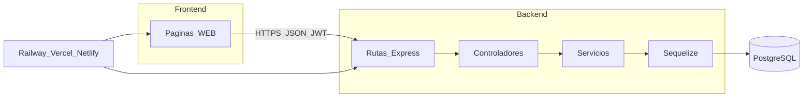

# Arquitectura — Trabajo grupal MVP

Versión resumida. Para detalle completo ver [trabajo-individual/arquitectura.md](../trabajo-individual/arquitectura.md).

## Naturaleza del producto

Sistema web **desplegado en producción** (no solo `localhost`):

- Usuario opera desde el **navegador** (frontend SPA).
- **API REST** (Express) persiste datos y aplica reglas de negocio.
- **PostgreSQL** almacena el estado (Sequelize + migraciones).
- **JWT** para rutas protegidas.



## Estructura mínima del repositorio

```text
mvp-grupal/
├── client/           # Frontend (React, Vue, etc.)
├── src/ o server/    # Backend Express
│   ├── routes/
│   ├── controllers/
│   ├── services/
│   ├── models/
│   └── middlewares/
├── migrations/
├── .env.example
├── .gitignore
└── README.md
```

## Convenciones API

- Prefijo sugerido: `/api/v1`
- JSON en request/response
- Códigos: `200`, `201`, `400`, `401`, `404`, `409`, `422`, `500`
- Errores con mensaje legible en JSON

## Deploy (obligatorio — MVP-GEN-07)

| Componente | Plataforma sugerida |
|------------|---------------------|
| API + PostgreSQL | Railway |
| Frontend | Vercel, Netlify o Railway |

Entregar en README y matriz:

- URL API
- URL frontend
- Usuario de prueba (email + contraseña) si aplica

## Variables de entorno

Documentar en `.env.example` (sin valores reales en el repo):

- `PORT`, `DATABASE_URL`, `JWT_SECRET`, `NODE_ENV`
- `VITE_API_URL` o equivalente en el front
